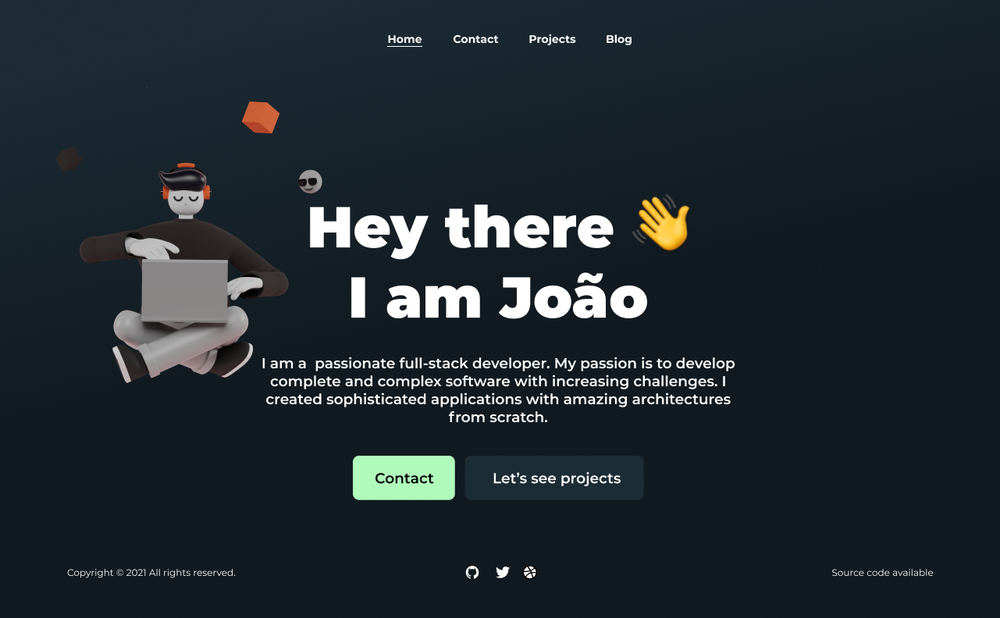

## My Personal Website 😁

[](https://sonarcloud.io/dashboard?id=Joao208_fe_personal_website)


<h1>
    
</h1>

## 🚀 Tecnologias utilizadas

O projeto foi desenvolvido utilizando as seguintes tecnologias

- [NextJs](https://nextjs.org/)
- [Styled Components](https://styled-components.com/)

## Links

[Demo](https://joaobarros.blog)
[Backend](https://github.com/Joao208/bk_personal_website)

---

## 🗂 Como rodar o projeto

```bash
    # Clonar o repositório
    $ git clone https://github.com/Joao208/fe_personal_website
    # Entrar no diretório
    $ cd fe_personal_website
    # Instalar as dependências
    $ yarn
    # Iniciar o projeto
    $ yarn dev
```

---

Template usado: [nextjs-complete-boilerplate](https://github.com/douglas-henrique/nextjs-complete-boilerplate) 🖤

Desenvolvido 🖤 por João Augusto Silva de Barros
